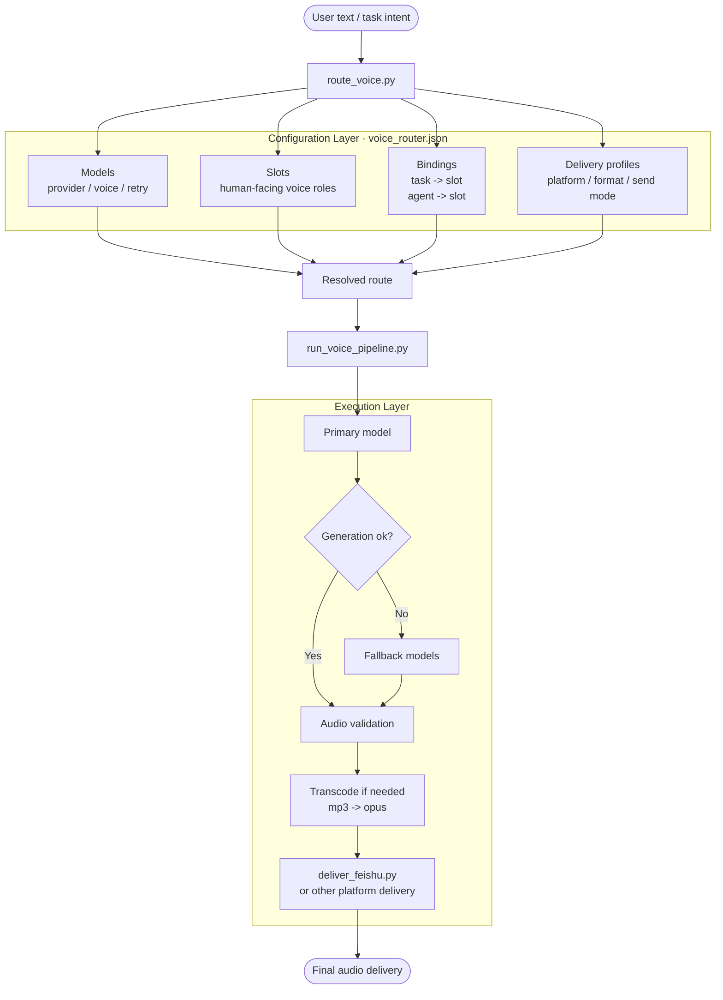

# voice-router

[English](./README.md) | [中文说明](./README.zh-CN.md)

> A configuration-first voice routing layer for TTS generation, validation, transcoding, and platform delivery.

`voice-router` turns a fragile “generate one file and send it” flow into a structured pipeline.
It separates **voice selection**, **provider generation**, **audio validation**, **transcoding**, and **delivery** so each layer stays understandable, testable, and replaceable.

## Why this project exists

Most voice workflows start small and become messy quickly:

- different tasks want different voices
- different agents need different defaults
- providers fail and need fallback chains
- platforms expect different audio formats
- an API saying `ok` does not guarantee the audio is actually playable

Instead of hardcoding all of that into one growing script, `voice-router` models the workflow explicitly.

## Highlights

- **Configuration-first routing** via `voice_router.json`
- **Task-level and agent-level defaults** for voice selection
- **Explicit fallback chains** across multiple providers and models
- **Platform-aware delivery rules** with a Feishu-focused v1 path
- **Validation and smoke tests** to reduce config drift
- **Reference documentation** for provider quirks and failure cases

## Good fit for

`voice-router` is a good fit if you need to:

- route different content types to different voices
- switch providers without rewriting your whole pipeline
- make fallback behavior explicit and inspectable
- normalize audio before delivery
- keep platform-specific delivery logic out of provider scripts

## Current scope

Version 1 is intentionally narrow.
The goal is not to solve every voice workflow at once.
The goal is to make one practical path reliable:

**Text -> TTS provider -> audio validation -> opus transcoding -> Feishu delivery**

Current v1 priorities:

- stable **Feishu** voice delivery
- support for **NoizAI**, **MiniMax**, **MiMo**, and **xAI** routing entries
- explicit fallback between models
- configuration-driven routing
- clear failure boundaries

## Quick start

### 1) Validate the config

```bash
python3 scripts/validate_config.py --config voice_router.json
```

### 2) Inspect route resolution

```bash
python3 scripts/route_voice.py \
  --config voice_router.json \
  --task daily_news --agent main --channel feishu
```

### 3) Run minimal smoke tests

```bash
python3 scripts/smoke_tests.py
```

### 4) Run provider integration smoke

```bash
python3 scripts/provider_integration_smoke.py \
  --config voice_router.json \
  --providers noizai minimax \
  --models model_noiz_default model_minimax_formal
```

## Architecture at a glance



The core idea is simple:

- configuration decides **what path should be used**
- scripts decide **how that path is executed**

## What v1 already includes

### Implemented

- route resolution
- NoizAI generation
- MiniMax generation
- `mp3 -> opus` transcoding
- Feishu delivery planning path
- model fallback execution
- structured provider notes and failure references

### Validated during development

- supported provider paths can generate audio
- opus outputs can be probed and validated
- Feishu delivery behavior has been exercised in the target workflow
- playback confirmation remains the preferred final verification step in real deployments

## Repository layout

```text
voice-router/
├── README.md
├── README.zh-CN.md
├── SKILL.md
├── voice_router.json
├── CHANGELOG.md
├── CONTRIBUTING.md
├── SECURITY.md
├── scripts/
│   ├── route_voice.py
│   ├── run_voice_pipeline.py
│   ├── generate_*.py
│   ├── deliver_feishu.py
│   ├── validate_config.py
│   └── smoke_tests.py
├── references/
│   ├── config-schema.md
│   ├── script-contract.md
│   ├── platform-feishu.md
│   ├── provider-*.md
│   └── failure-cases.md
└── .github/
    ├── ISSUE_TEMPLATE/
    └── pull_request_template.md
```

## Key files

| File | Purpose |
|---|---|
| `voice_router.json` | Source of truth for models, slots, bindings, routing, delivery, and validation |
| `scripts/route_voice.py` | Route resolution only |
| `scripts/run_voice_pipeline.py` | Minimal orchestration path for v1 |
| `scripts/generate_noizai.py` | NoizAI generation wrapper |
| `scripts/generate_minimax.py` | MiniMax generation wrapper |
| `scripts/transcode_to_opus.sh` | Transcoding and probe validation |
| `scripts/deliver_feishu.py` | Feishu delivery-plan preparation |
| `references/` | Provider notes, schema docs, and failure cases |
| `SKILL.md` | Agent-facing workflow and maintenance conventions |

## Provider and delivery strategy

### NoizAI

For v1, NoizAI favors a stable generation path over aggressive voice-id management:

- prefer reference-audio mode by default
- do not assume legacy human-readable names are valid `voice_id` values
- treat non-audio error payloads as generation failures early

### MiniMax

MiniMax is connected through a minimal HTTP TTS path.
The default configuration uses:

- `speech-2.8-hd`

Provider-side model availability can vary by account tier, entitlement, region, or future API changes, so treat that as a recommended default rather than a universal guarantee.

### Feishu

Feishu is the main delivery target in v1.
Current policy:

- do not default to direct mp3 delivery
- transcode to `opus`
- use `audio_file` mode
- do not treat API success alone as final success
- prefer receiving-side playback confirmation as the real closure signal

## Design principles

- **Configuration first**: put default behavior in `voice_router.json`, not scattered across scripts
- **Clear separation of concerns**: routing, generation, validation, transcoding, and delivery should stay distinct
- **Fallback must be real**: failure should advance to the next eligible model
- **Validation is required**: a returned file is not automatically a good file
- **Delivery should be platform-aware**: format and send mode belong to delivery profiles

## Limitations

v1 deliberately does **not** try to cover everything.
Out of scope for now:

- multi-character script splitting
- emotion-driven automatic voice selection
- DAW-grade audio post-processing
- full multi-platform delivery expansion
- GUI-based configuration management

## Roadmap

### v1.1
- cleaner entry points
- smoother invocation ergonomics
- better operational summaries

### v1.2
- more providers
- finer-grained fallback policies
- stronger diagnostics and failure reporting

### v1.3
- more delivery platforms
- non-Feishu delivery profiles implemented in practice

## Documentation

- [中文说明](./README.zh-CN.md)
- [Configuration schema](./references/config-schema.md)
- [Script contract](./references/script-contract.md)
- [Feishu platform notes](./references/platform-feishu.md)
- [NoizAI provider notes](./references/provider-noizai.md)
- [MiniMax provider notes](./references/provider-minimax.md)
- [Failure cases](./references/failure-cases.md)

## Contributing and project policies

- See [CONTRIBUTING.md](./CONTRIBUTING.md) for contribution workflow
- See [SECURITY.md](./SECURITY.md) for reporting vulnerabilities
- See [CHANGELOG.md](./CHANGELOG.md) for release history

## License

[MIT](./LICENSE)
