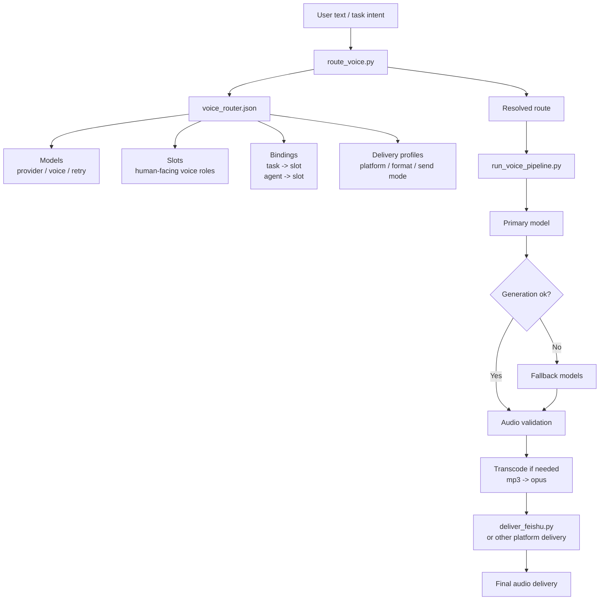

# voice-router

[English](./README.md) | [中文说明](./README.zh-CN.md)

> A structured voice routing layer for TTS generation, validation, transcoding, and platform delivery.

`voice-router` is a routing-oriented voice workflow package that separates **voice selection**, **provider generation**, **audio validation**, **transcoding**, and **platform delivery** into clean, inspectable layers.

It is built for teams and agents that need more than “generate one audio file and send it”.

---

## 中文简介

`voice-router` 是一个面向路由的 TTS 语音编排层，用来把 **声音选择**、**Provider 生成**、**音频校验**、**转码处理**、**平台发送** 拆成清晰的独立层级。

它主要解决这几类常见问题：

- 不同任务想用不同声音
- 不同助手需要不同人格化声线
- 某个 provider 失败时要自动 fallback
- 不同平台对音频格式和发送方式要求不同
- 语音流程越长越容易变成“脚本堆”

当前 v1 的核心目标非常明确：

**文本 → TTS Provider → 音频校验 → Opus 转码 → Feishu 发送**

如果你主要看中文，建议直接阅读：
**[`README.zh-CN.md`](./README.zh-CN.md)**

---

## Highlights

- **Configuration-first routing** via `voice_router.json`
- **Task-level and agent-level defaults** for voice selection
- **Explicit fallback chains** across multiple models/providers
- **Platform-aware delivery** with Feishu-focused output rules
- **Validation and smoke tests** to reduce config drift
- **Reference docs** for provider quirks and failure cases

---

## What problem it solves

Most voice workflows start simple and then get messy fast.

You begin with “generate one audio file and send it”, and soon run into problems like:

- task-specific default voices
- agent-specific default voices
- provider switching
- platform-specific formats
- delivery instability
- fallback requirements

Instead of hardcoding all of those rules into one script, `voice-router` turns them into a configurable system.

---

## Current v1 scope

Version 1 is intentionally narrow.

Its goal is not to build a giant voice platform all at once.
Its goal is to make **one stable production path** real:

**Text -> TTS provider -> audio validation -> opus transcoding -> Feishu delivery**

Current v1 priorities:

- stable **Feishu** voice delivery
- support for **NoizAI**, **MiniMax**, **MiMo**, and **xAI** routing entries
- explicit fallback between models
- configuration-driven routing
- clear failure boundaries

---

## Quick start

### 1) Validate the config

```bash
python3 scripts/validate_config.py --config voice_router.json
```

### 2) Inspect route resolution

```bash
python3 scripts/route_voice.py \
  --config voice_router.json \
  --task daily_news --agent main --channel feishu
```

### 3) Run minimal smoke tests

```bash
python3 scripts/smoke_tests.py
```

### 4) Run provider integration smoke

```bash
python3 scripts/provider_integration_smoke.py \
  --config voice_router.json \
  --providers noizai minimax \
  --models model_noiz_default model_minimax_formal
```

---

## Repository layout

```text
voice-router/
├── SKILL.md
├── README.md
├── README.zh-CN.md
├── voice_router.json
├── scripts/
│   ├── route_voice.py
│   ├── run_voice_pipeline.py
│   ├── generate_*.py
│   ├── deliver_feishu.py
│   ├── validate_config.py
│   └── smoke_tests.py
└── references/
    ├── config-schema.md
    ├── script-contract.md
    ├── platform-feishu.md
    ├── provider-*.md
    └── failure-cases.md
```

---

## Architecture at a glance



This is the core idea of `voice-router`: configuration decides **what voice path should be used**, scripts execute **how that path is generated, validated, transcoded, and delivered**.

---

## What is already working in v1

`voice-router v1` has already been implemented and verified end-to-end.

### Implemented

- route resolution
- NoizAI generation
- MiniMax generation
- `mp3 -> opus` transcoding
- Feishu delivery path
- model fallback execution
- structured provider notes and failure references

### Verified in real use

- audio files were actually generated
- opus output was actually probed
- Feishu delivery was actually tested
- playback was actually confirmed on the receiving side

This is not a design draft anymore.
It is a working v1.

---

## Core design

`voice-router` uses a four-layer structure.

### 1. Models
The provider capability layer.

Defines things like:

- provider
- model name
- voice id / reference mode
- timeout / retry
- tags / status

Examples:

- `model_noiz_default`
- `model_minimax_default`

---

### 2. Slots
The human-facing voice role layer.

A slot is not a provider detail.
It is a business-facing voice role.

Examples:

- main assistant voice
- morning briefing voice
- alert voice
- art assistant voice

Each slot can define:

- primary model
- fallback models
- persona
- display name

---

### 3. Bindings
The default mapping layer.

Bindings connect:

- tasks -> slots
- agents -> slots

Examples:

- `morning_brief -> slot_morning`
- `main -> slot_main`

---

### 4. Delivery
The platform delivery layer.

Defines things like:

- target platform
- preferred output format
- send mode
- output directory
- platform capability differences

In v1, the main target is:

- `feishu`
- `preferred_format = opus`
- `send_mode = audio_file`

---

## Routing order

By default, routing resolves in this order:

1. `explicit_slot`
2. `explicit_model`
3. `task_binding`
4. `agent_binding`
5. default fallback

If a slot is selected, the execution path becomes:

- use `primary_model`
- if it fails, continue through `fallback_models`

This makes fallback a first-class part of the routing system instead of an afterthought.

---

## Credentials and environment

For long-term use, provider keys should be injected through the OpenClaw runtime environment, not written into `voice_router.json`, shell scripts, or Markdown notes.

Recommended variables:

- `MINIMAX_API_KEY`
- `NOIZ_API_KEY`
- `XAI_API_KEY`

Recommended persistent location on OpenClaw hosts:

- `~/.openclaw/.env`

Why this is the default:

- works for Gateway-launched cron and isolated runs
- avoids binding secrets to one skill only
- easier to migrate across machines
- avoids accidental git commits and config leakage

Current script behavior:

- first read process env
- then fall back to `~/.openclaw/.env`
- NoizAI additionally keeps compatibility with `~/.noiz_api_key`

macOS note:

When OpenClaw runs as a LaunchAgent, shell-only env vars are often not inherited by background jobs. Prefer `~/.openclaw/.env` for stable cron behavior.

Path note:

Do not hardcode Linux-only workspace paths like `/home/...` in provider scripts. Resolve paths from the current skill/workspace on the running host.

## Current provider strategy

### NoizAI
In v1, NoizAI is used in a stability-first way.

Operational note:

- provider key should come from `NOIZ_API_KEY`
- local file `~/.noiz_api_key` is compatibility fallback only, not the preferred long-term path

Current strategy:

- default to reference-audio mode
- do not assume old human-readable voice names are valid `voice_id`s

Reason:

- legacy values like `zf_xiaoni` may fail with `Voice not found`
- some failures return JSON payloads instead of valid audio

So for v1, NoizAI is configured to prioritize a stable generation path over aggressive voice-id management.

### MiniMax
MiniMax is connected through a minimal HTTP TTS path.

Real testing showed that the currently available token plan supports:

- `speech-2.8-hd`

So in v1, the stable MiniMax default is:

- `model = speech-2.8-hd`

This keeps the provider path simple and reliable.

---

## Current Feishu strategy

Feishu is the core delivery target in v1.

Current policy:

- do not default to direct mp3 send
- transcode to `opus`
- use `audio_file` mode
- do not treat API success alone as final success
- treat successful user-side playback as the actual closure condition

That choice was made from real delivery behavior, not just from interface assumptions.

---

## Repository structure

```text
voice-router/
├── README.md
├── SKILL.md
├── voice_router.json
├── references/
│   ├── config-schema.md
│   ├── failure-cases.md
│   ├── platform-feishu.md
│   ├── provider-minimax.md
│   └── provider-noizai.md
└── scripts/
    ├── route_voice.py
    ├── generate_noizai.py
    ├── generate_minimax.py
    ├── transcode_to_opus.sh
    ├── deliver_feishu.py
    └── run_voice_pipeline.py
```

---

## Key files

| File | Role |
|---|---|
| `voice_router.json` | Single source of truth for models, slots, bindings, routing, delivery, and validation |
| `SKILL.md` | Internal skill behavior, workflow rules, and design principles |
| `README.md` | Human-facing project introduction |
| `scripts/route_voice.py` | Route resolution only |
| `scripts/generate_noizai.py` | NoizAI generation only |
| `scripts/generate_minimax.py` | MiniMax generation only |
| `scripts/transcode_to_opus.sh` | Transcoding + ffprobe validation |
| `scripts/deliver_feishu.py` | Feishu delivery-plan preparation |
| `scripts/run_voice_pipeline.py` | Minimal v1 pipeline runner |

---

## Scope boundary

### v1 does handle

- voice routing
- provider selection
- model fallback
- audio validation
- opus transcoding
- stable Feishu delivery path

### v1 does not try to handle yet

- multi-character script splitting
- emotional auto-selection of voices
- DAW-level audio post-production
- full multi-platform delivery expansion
- UI-based configuration management

This is deliberate.

v1 is meant to be stable, understandable, and extensible — not overloaded.

---

## Design principles

The system follows a few strict principles:

- **Configuration first**: defaults belong in `voice_router.json`, not in random scripts
- **Layer separation**: routing and delivery should never be mixed together
- **Fallback is real**: failures should move to the next model, not just stop silently
- **Validation matters**: a returned `ok` is not enough
- **User playback is the final check**: especially on Feishu

---

## Current conclusion

`voice-router v1` is already in the “working system” stage.

It is no longer just:

- a concept
- a schema
- a prototype

It is now:

- structured
- tested
- routed
- transcodable
- fallback-capable
- Feishu-deliverable

---

## Roadmap

Suggested next versions:

### v1.1
- cleaner entrypoints
- smoother invocation UX
- better operator-facing summaries

### v1.2
- more providers
- finer fallback strategies
- stronger diagnostics and error reporting

### v1.3
- multi-platform delivery expansion
- platform-specific delivery profiles beyond Feishu

---

## Status

**Current state: v1 locked.**

The core structure should remain stable.
Future work should iterate on top of v1, not rebuild it from scratch.
