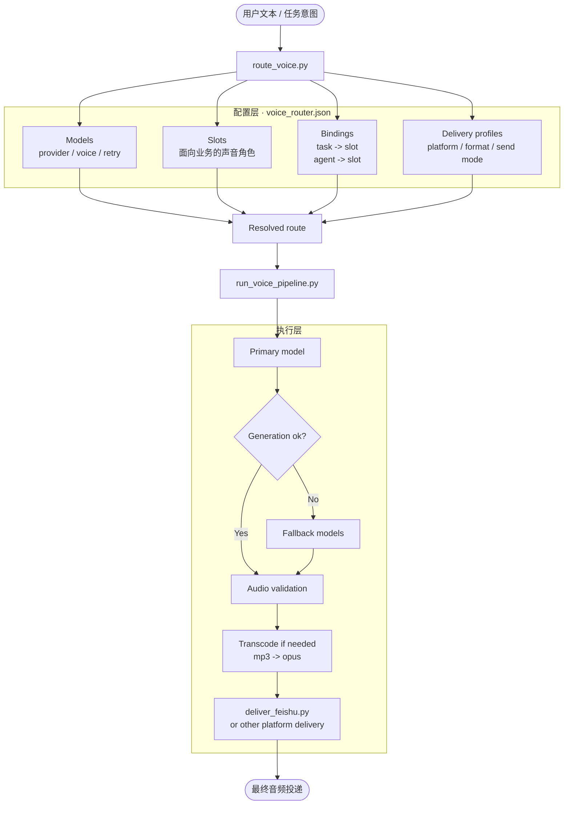

# voice-router

[English](./README.md) | [中文说明](./README.zh-CN.md)

> 一个以配置为中心的语音路由层，用来组织 TTS 生成、音频校验、转码与平台投递。

`voice-router` 不是单一的 TTS 脚本，也不是单一的平台发送器。
它把一条完整语音链路里的关键决策拆开管理：**声音选择**、**provider 生成**、**音频校验**、**格式转码**、**平台投递**。

这样做的目的，是把原本容易越写越乱的“脚本堆”，变成一个可理解、可维护、可扩展的工作流。

## 为什么要做这个

大多数语音链路一开始都很简单：

> 生成一个音频，然后发出去。

但只要需求一复杂，问题就会立刻出现：

- 不同任务想用不同声音
- 不同助手需要不同默认声线
- provider 会失效，需要 fallback
- 平台之间的音频格式要求不一样
- API 返回 `ok`，不代表用户侧真的能播放

`voice-router` 的目标，就是把这些规则显式建模，而不是把它们继续硬编码进一个越来越大的脚本里。

## 亮点

- **配置优先**：通过 `voice_router.json` 驱动路由
- **任务级 / 助手级默认声音**：声音规则可显式表达
- **显式 fallback 链**：跨 provider / model 的兜底策略可检查、可维护
- **平台感知的投递层**：v1 重点围绕 Feishu 稳定链路设计
- **校验与 smoke tests**：减少配置漂移和回归风险
- **参考文档完整**：保留 provider 差异与失败案例

## 适合什么场景

如果你需要下面这些能力，`voice-router` 会比较合适：

- 让不同内容类型走不同声音
- 更换 provider 时不想重写整条链路
- 把 fallback 逻辑做成明确规则，而不是临时补丁
- 在投递前统一做音频校验和转码
- 把平台差异从 provider 脚本里剥离出来

## 当前范围

v1 是刻意收敛的。
它不是一上来就做“全平台语音系统”，而是先把一条实际可用的链路做扎实：

**文本 -> TTS provider -> 音频校验 -> opus 转码 -> Feishu 投递**

当前 v1 的重点：

- 稳定的 **Feishu** 语音投递
- 支持 **NoizAI**、**MiniMax**、**MiMo**、**xAI** 路由入口
- 支持显式 fallback
- 以配置驱动路由
- 有清晰的失败边界

## 快速开始

### 1）校验配置

```bash
python3 scripts/validate_config.py --config voice_router.json
```

### 2）查看路由解析结果

```bash
python3 scripts/route_voice.py \
  --config voice_router.json \
  --task daily_news --agent main --channel feishu
```

### 3）跑最小 smoke tests

```bash
python3 scripts/smoke_tests.py
```

### 4）跑 provider integration smoke

```bash
python3 scripts/provider_integration_smoke.py \
  --config voice_router.json \
  --providers noizai minimax \
  --models model_noiz_default model_minimax_formal
```

## 架构概览



这个项目的核心思想很简单：

- **配置层** 决定这次应该走哪条声音路径
- **脚本层** 负责把这条路径真正执行出来

## v1 已经包含什么

### 已实现

- 路由解析
- NoizAI 生成
- MiniMax 生成
- `mp3 -> opus` 转码
- Feishu 投递计划路径
- model fallback 执行
- provider 说明文档与失败案例沉淀

### 开发阶段已验证

- 受支持的 provider 路径可以生成音频
- opus 输出可以被 probe 与校验
- Feishu 投递行为已在目标工作流中验证过
- 在真实部署里，仍建议以“接收端可正常播放”作为最终确认

## 仓库结构

```text
voice-router/
├── README.md
├── README.zh-CN.md
├── SKILL.md
├── voice_router.json
├── CHANGELOG.md
├── CONTRIBUTING.md
├── SECURITY.md
├── scripts/
│   ├── route_voice.py
│   ├── run_voice_pipeline.py
│   ├── generate_*.py
│   ├── deliver_feishu.py
│   ├── validate_config.py
│   └── smoke_tests.py
├── references/
│   ├── config-schema.md
│   ├── script-contract.md
│   ├── platform-feishu.md
│   ├── provider-*.md
│   └── failure-cases.md
└── .github/
    ├── ISSUE_TEMPLATE/
    └── pull_request_template.md
```

## 关键文件

| 文件 | 作用 |
|---|---|
| `voice_router.json` | 单一事实来源，定义 models、slots、bindings、routing、delivery、validation |
| `scripts/route_voice.py` | 只负责路由解析 |
| `scripts/run_voice_pipeline.py` | v1 的最小主流程串联器 |
| `scripts/generate_noizai.py` | NoizAI 生成包装层 |
| `scripts/generate_minimax.py` | MiniMax 生成包装层 |
| `scripts/transcode_to_opus.sh` | 转码与 probe 校验 |
| `scripts/deliver_feishu.py` | Feishu 投递计划准备 |
| `references/` | provider 说明、schema 文档、失败案例 |
| `SKILL.md` | 面向 agent 的工作流约定与维护规则 |

## Provider 与投递策略

### NoizAI

在 v1 里，NoizAI 以“稳定生成优先”为主：

- 默认优先参考音频模式
- 不假设历史的人类可读名称一定等于真实 `voice_id`
- 发现非音频错误 payload 时尽早失败，不把错误留给后续转码阶段

### MiniMax

MiniMax 当前走最小 HTTP TTS 路径。
默认配置使用：

- `speech-2.8-hd`

但 provider 侧模型可用性可能会受到账号等级、权限、区域或后续 API 变化影响，因此这里更适合作为推荐默认值，而不是对所有环境都成立的保证。

### Feishu

Feishu 是 v1 的主投递目标。
当前策略：

- 不默认直发 mp3
- 统一转成 `opus`
- 使用 `audio_file` 模式发送
- 不把 API 返回成功当成最终成功
- 更建议以接收端可播放作为真正闭环信号

## 设计原则

- **配置优先**：默认行为写进 `voice_router.json`，不要散落到脚本里
- **分层明确**：路由、生成、校验、转码、投递尽量分离
- **fallback 要真执行**：失败后必须切到下一个可用模型
- **校验不能省**：返回了文件，不等于返回了可用文件
- **投递必须平台感知**：格式和 send mode 属于 delivery profile 的职责

## 当前限制

v1 有意不覆盖所有场景。
当前暂不处理：

- 多角色剧本拆分
- 按情绪自动选 voice
- DAW 级音频后期处理
- 完整多平台投递扩展
- 图形化配置管理

## Roadmap

### v1.1
- 更干净的入口
- 更顺手的调用体验
- 更好的操作侧摘要输出

### v1.2
- 更多 provider
- 更细的 fallback 策略
- 更强的诊断与报错能力

### v1.3
- 多平台投递扩展
- 非 Feishu 平台 profile 的实际落地

## 文档导航

- [English README](./README.md)
- [配置 schema](./references/config-schema.md)
- [脚本契约](./references/script-contract.md)
- [Feishu 平台说明](./references/platform-feishu.md)
- [NoizAI provider 说明](./references/provider-noizai.md)
- [MiniMax provider 说明](./references/provider-minimax.md)
- [失败案例](./references/failure-cases.md)

## 贡献与项目规则

- 贡献方式见 [CONTRIBUTING.md](./CONTRIBUTING.md)
- 安全问题提报见 [SECURITY.md](./SECURITY.md)
- 版本变更记录见 [CHANGELOG.md](./CHANGELOG.md)

## License

[MIT](./LICENSE)
